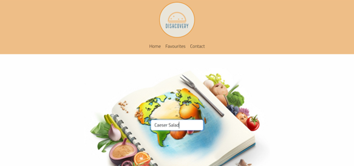
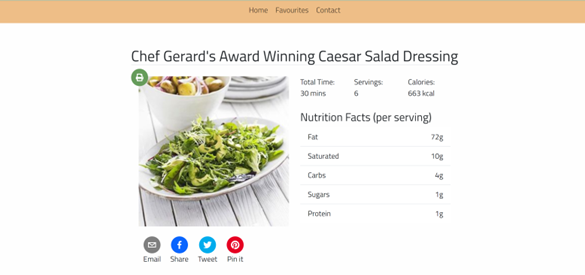
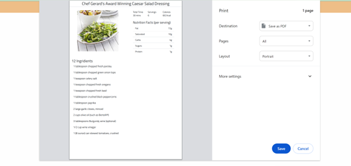
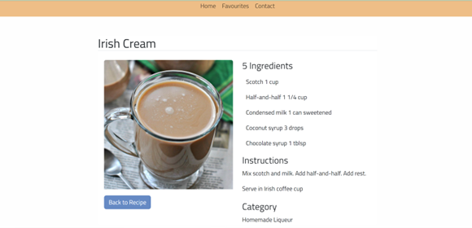
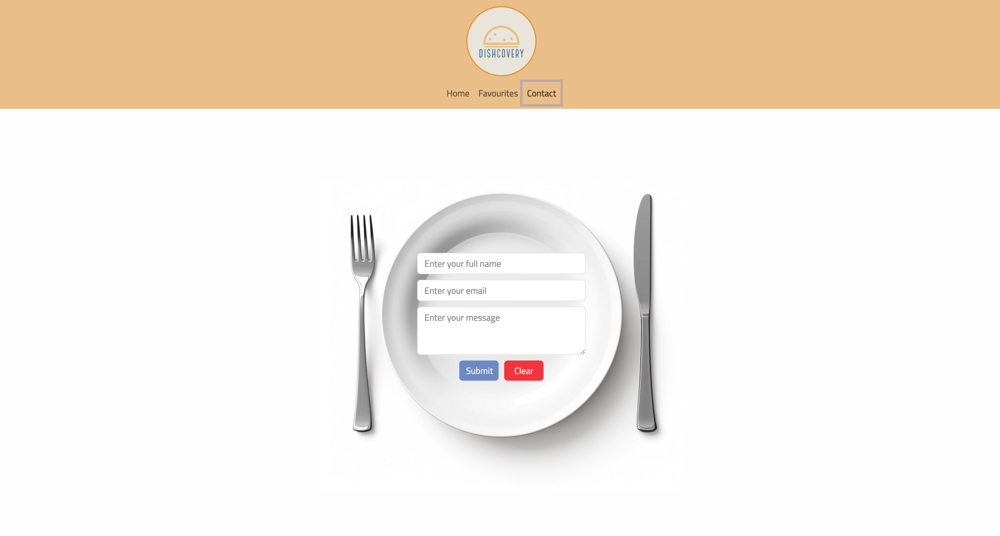

# DishCovery 🥙

Navigate Flavour Frontiers! A fun app to get recipes, drink recommendations and nutritional information

## Expectations

---

With your group, you’ll again conceive and execute a design that solves a real-world problem. In creating your first collaborative front-end, single-page application, you’ll create a React front end to build a user-focused platform. You’ll continue to build on the agile development methodologies you’ve used throughout this course. These include storing your project code in GitHub, managing your work with a project management tool, and implementing feature and bug fixes using the Git branch workflow and pull requests.

## Learning Objectives 📚

---

<li>
Use React
<li>
Use Node.js
<li>
Have both GET and POST routes for retrieving and adding new data
<li>
Be deployed using Netlify
<li>
Use at least two libraries, packages, or technologies that we haven't discussed
<li>
Have a polished front end/UI
<li>
Meet good quality coding standards (indentation, scoping, naming)
<li>
Prepare a professional presentation and repository README for your project
 
 

## Tools 🛠️

---

The following tools are to be used in this project:

<ol>
<li> Node.js
<li> React
<li> React - Toastify
<li> React - Print
<li> HTML and CSS
<li> Bootstrap
<li> Form to take input from a user and respond from that input
<li> Modals
<li> Client-side storage
<li> Responsive. When the web-page is resized the site responds accordingly
<li> APIs: TheCocktail Database, Edamam Database, API Ninjas Nutrition
</ol>

## Project Description

The DishCovery Project is a fun food web application designed to help users explore new recipes and cooking ideas, find complimentary drinks for their meal, obtain nutritional information and save their favourite searches.

The main motivation behind DishCovery is to push the initial concept (Dish Discovery) to the next level whilst inspiring culinary creativity that makes the process of finding new and exciting recipes more accessible.

The project was built to address the common challenge of deciding what to cook by providing a user-friendly interface for discovering, exploring, and saving recipes. It then helps in providing the user with drink choices as well as nutritional information based on their search.

It aims to solve the problem of monotony in cooking and meal planning by offering a diverse range of recipes and drinks for users to try.

During the development of this project, valuable insights into web development using libraries such as React, API integration via React components, and user experience/ user interface design were gained. Additionally, skills in handling data manipulation, project planning and collaborative work were honed.

## Table of Contents

- [Methodology](#methodology)
- [Conclusion](#conclusion)
- [Future Improvements](#futureimprovements)
- [Website Preview](#websitepreview)
- [Installation](#installation)
- [Usage](#usage)
- [Collaborators](#collaborators)
- [License](#license)

## Methodology

---

This application is a multi page web-application. It will ask the user for an input of a recipe of their choice. Once they click search it will populate a recipe, drink and nutritional information based on the recipe found. The user will also have the ability to add their recipe's to favourites, just so they can have quick access to recipes when needed.
 
 
Below is our approach to this task:

<ol>
<li> We built the initial foundation based on our wireframe 
<li> We split the roles up based on components within our React build
<li> We each took to our separate sections, communicating upon completion and issues.
<li> Those more able perfected others pages.
<li> Everyone else completed other tasks necessary for deployment.
<li> We divided presentation slides.
<li> We deployed working application
</ol>

## Conclusion

## Future Improvements

As a group we worked really well together. We understood that our skillset was varied, and so based on this, team members went above and beyond to contribute to the best of their ability. No issues were faced. However, there somethings we could improve on:

<ol>
<li> 
<li> 
</ol>

## Website Preview

ADD SCREENSHOTS OF THE NEW SITE HERE

## Installation 💻

To run the DishCover Project locally, follow these steps:

Clone the repository to your local machine.
Navigate to the project directory.
Npm run dev and access the provided link in the terminal

Repo can be accessed here:

https://github.com/martindocs-bootcamp/dishcovery

Deployed site can be accessed here:

https://dishcoveryapp.netlify.app/

## Usage

- Enter your desired dish or cuisine in the search bar.
- 
- Hit enter on your keyboard to retrieve recipe suggestions.
- 
- Explore the displayed recipe instructions, ingredients, drink suggestion and nutritional information.
- Print the chosen recipe using the print icon.
- 
- If thirsty, use the app to find a matching drink recipe.
-  
- Save your favorite recipes using the "♥" button.

## Collaborators

<ol>
<li> <a href='https://github.com/martindocs'> Marcin Tatarski - Github Profile
<li> <a href='https://github.com/TuuPuu'> Elora Ainoa - Github Profile
<li> <a href='https://github.com/rrana5106'> Rupesh Rana Magar - Github Profile
<li> <a href='https://github.com/oliverstamper'> Oliver Stamper - Github Profile
<li> <a href='https://github.com/ariestikto'> Pratikto Ariestyadi - Github Profile
<li> <a href='https://github.com/stevecalla'> Steve Calla - Github Profile

</ol>

## License

This project is licensed under the MIT License.
